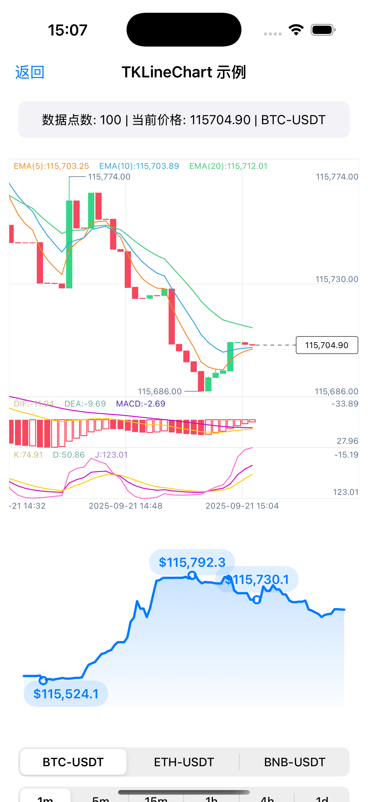
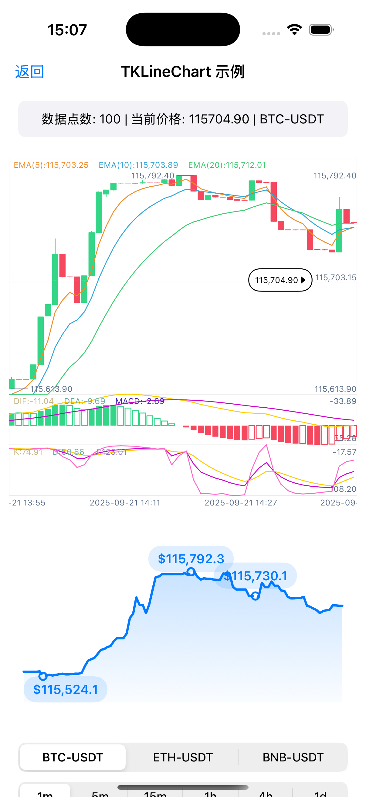
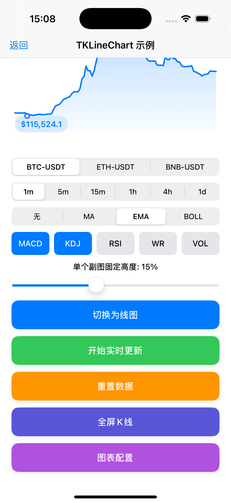

## TKLineChart

一个纯 Swift 的专业 K 线图/深度图组件，支持主图与多副图指标、手势交互与实时更新。本文档为"引用指南"，帮助你快速集成到项目中。

> 🤖 **AI 辅助开发**: 本项目在 AI 辅助下创建，结合了现代 Swift 开发最佳实践与金融图表需求。
> 
> 🙏 **致谢**: 本项目参考了 [flutter_k_chart](https://github.com/gwhcn/flutter_k_chart) 的设计思路与实现方案，感谢原作者 [@gwhcn](https://github.com/gwhcn) 的贡献。

## 示例与演示
- 示例 App: `Examples/TKLineChartDemo`
- 运行后可查看：
  - 指标切换（主图单选、副图多选）
  - 横屏全屏展示与滚动指标栏
  - 模拟数据与实时更新

### 应用截图

<div align="center">
  
  
</div>

<div align="center">
  
  
</div>

**功能展示：**
- **图1**: K线图主界面，支持蜡烛图和线图切换，显示多种技术指标
- **图2**: 指标配置界面，可自定义主图和副图指标参数
- **图3**: 横屏全屏模式，提供更好的图表查看体验
- **图4**: 深度图展示，显示买卖盘深度信息


### 兼容性
- **iOS**: 13.0+
- **Swift**: 5.7+
- **包管理**: Swift Package Manager (SPM)

## 安装

### Swift Package Manager (推荐)
在 Xcode 中选择 File → Add Packages…，输入仓库地址并添加：

```
https://github.com/moQingTing/TKLineChart
```

添加完成后，在目标的 Frameworks, Libraries, and Embedded Content 中确认已包含 `TKLineChart`。

### CocoaPods
在 `Podfile` 中添加：

```ruby
pod 'TKLineChart', '~> 2.0.0'
```

然后运行：

```bash
pod install
```

## 快速集成
### 1) 创建并放置视图
```swift
import TKLineChart

let chartView = TKLineChartView()
chartView.translatesAutoresizingMaskIntoConstraints = false
view.addSubview(chartView)
NSLayoutConstraint.activate([
    chartView.topAnchor.constraint(equalTo: view.safeAreaLayoutGuide.topAnchor),
    chartView.leadingAnchor.constraint(equalTo: view.leadingAnchor, constant: 12),
    chartView.trailingAnchor.constraint(equalTo: view.trailingAnchor, constant: -12),
    chartView.heightAnchor.constraint(equalToConstant: 360)
])
```

### 2) 基本配置
```swift
// 创建图表配置
let chartConfiguration = ChartConfiguration()
chartView.chartConfiguration = chartConfiguration

// 设置数字小数位数
chartView.numberFractionDigits = 2

// 主图：MA/EMA/BOLL 三选一（带参数）
chartView.mainState = .ema(5, 10, 20)

// 副图：可多选（示例：成交量与 MACD）
chartView.secondaryStates = [
    .vol(5, 10),
    .macd(12, 26, 9)
]
```

### 3) 准备数据并计算指标
```swift
var data: [CompleteKLineEntity] = []
// 生成/加载 K 线数据（OHLCV 与时间戳必填）
for i in 0..<120 {
    let e = CompleteKLineEntity(
        open: 100 + Double.random(in: -2...2),
        high: 105,
        low: 95,
        close: 100 + Double.random(in: -2...2),
        volume: Double.random(in: 1000...6000),
        timestamp: Int(Date().timeIntervalSince1970) + i*60
    )
    data.append(e)
}

// 计算主图与副图指标（必须在 updateData 之前执行）
DataUtil.calculate(data, main: chartView.mainState, seconds: chartView.secondaryStates)

// 刷新图表
chartView.updateData(data)
```

### 4) 实时更新（可选）
```swift
// 拉到一根新K线（新时间戳）或更新最后一根（相同时间戳）后：
DataUtil.calculate(data, main: chartView.mainState, seconds: chartView.secondaryStates)
chartView.updateData(data)
```

## 常见用法
- **切换线图/蜡烛图**
```swift
chartView.isLine = true // or false
```

- **切换主图指标（单选）**
```swift
chartView.mainState = .boll(20, 2)
DataUtil.calculate(data, main: chartView.mainState, seconds: chartView.secondaryStates)
chartView.updateData(data)
```

- **切换副图指标（多选）**
```swift
chartView.secondaryStates = [.vol(5, 10), .macd(12, 26, 9), .rsi(14)]
DataUtil.calculate(data, main: chartView.mainState, seconds: chartView.secondaryStates)
chartView.updateData(data)
```

## 指标一览
- **主图**: `.ma(Int,Int,Int)`, `.ema(Int,Int,Int)`, `.boll(Int,Int)`, `.none`
- **副图**: `.vol(Int,Int)`, `.macd(Int,Int,Int)`, `.kdj(Int,Int,Int)`, `.rsi(Int)`, `.wr(Int)`

## 深度图（可选）
```swift
let depthView = TKDepthChartView()
depthView.chartColors = ChartColors(isDarkMode: false)
depthView.decimal = 2
depthView.bids = [DepthEntity(price: 99.8, amount: 120)]
depthView.asks = [DepthEntity(price: 100.2, amount: 130)]
```

## 配置引用指南

### 基础配置
```swift
// 创建图表配置实例
let chartConfiguration = ChartConfiguration()

// 应用内置主题（通过ChartColors）
let chartColors = ChartColors(isDarkMode: false)
chartColors.applyBinanceTheme()  // 币安风格
chartColors.applyLightTheme()    // 浅色主题
chartColors.applyDarkTheme()     // 深色主题

// 设置到图表
chartView.chartConfiguration = chartConfiguration
chartView.chartColors = chartColors
```

### 颜色配置
```swift
// 创建颜色配置
let chartColors = ChartColors(isDarkMode: false)  // 浅色模式
let chartColors = ChartColors(isDarkMode: true)   // 深色模式

// 蜡烛图颜色
chartConfiguration.candleStyle.upColor = UIColor.green      // 上涨颜色
chartConfiguration.candleStyle.downColor = UIColor.red      // 下跌颜色

// 背景颜色
chartColors.bgColor = UIColor.black                         // 主背景色
chartColors.gridColor = UIColor.gray                        // 网格线颜色

// 文字颜色
chartColors.yAxisTextColor = UIColor.white                  // Y轴文字颜色
chartColors.xAxisTextColor = UIColor.white                  // X轴文字颜色
chartColors.selectedPriceTextColor = UIColor.white          // 选中价格文字颜色

// 技术指标颜色
chartColors.ma5Color = UIColor.yellow                       // MA5线颜色
chartColors.ma10Color = UIColor.systemPink                  // MA10线颜色
chartColors.ma30Color = UIColor.purple                      // MA30线颜色

// MACD颜色
chartColors.difColor = UIColor.yellow                       // DIF线颜色
chartColors.deaColor = UIColor.blue                         // DEA线颜色
chartColors.macdColor = UIColor.red                         // MACD柱状图颜色

// KDJ颜色
chartColors.kColor = UIColor.yellow                         // K线颜色
chartColors.dColor = UIColor.blue                           // D线颜色
chartColors.jColor = UIColor.red                            // J线颜色

// RSI颜色
chartColors.rsiColor = UIColor.orange                       // RSI线颜色

// 成交量颜色
chartColors.volColor = UIColor.blue                         // 成交量颜色

// 深度图颜色
chartColors.depthBuyColor = UIColor.red                     // 买单颜色
chartColors.depthSellColor = UIColor.green                  // 卖单颜色
chartColors.depthTextColor = UIColor.black                  // 深度图文字颜色

// 选中显示颜色
chartColors.markerBorderColor = UIColor.gray                // 标记边框颜色
chartColors.markerBgColor = UIColor.black                   // 标记背景颜色

// 实时价格颜色
chartColors.realTimeLineColor = UIColor.blue                // 实时价格线颜色
chartColors.realTimeTextColor = UIColor.white               // 实时价格文字颜色
chartColors.realTimeTextBorderColor = UIColor.gray          // 实时价格边框颜色
```

### 样式配置
```swift
// 蜡烛图样式配置
chartConfiguration.candleStyle.width = 6.0                  // 蜡烛宽度
chartConfiguration.candleStyle.lineWidth = 0.8              // 蜡烛中间线宽度
chartConfiguration.candleStyle.isSolid = true               // 是否实心蜡烛

// 成交量样式配置
chartConfiguration.volumeStyle.barWidth = 6.5               // 成交量柱子宽度
chartConfiguration.volumeStyle.upColor = UIColor.green      // 上涨成交量颜色
chartConfiguration.volumeStyle.downColor = UIColor.red      // 下跌成交量颜色

// MACD样式配置
chartConfiguration.macdStyle.barWidth = 6.5                 // MACD柱子宽度
chartConfiguration.macdStyle.difColor = UIColor.yellow      // DIF线颜色
chartConfiguration.macdStyle.deaColor = UIColor.blue        // DEA线颜色
chartConfiguration.macdStyle.barColor = UIColor.red         // MACD柱状图颜色

// 网格配置
chartConfiguration.chartStyleConfig.gridRows = 2            // 网格行数
chartConfiguration.chartStyleConfig.gridColumns = 3         // 网格列数
chartConfiguration.chartStyleConfig.gridStrokeWidth = 0.5   // 网格线宽度

// 内边距配置
chartConfiguration.chartStyleConfig.topPadding = 15.0       // 顶部内边距
chartConfiguration.chartStyleConfig.bottomDateHigh = 15.0   // 底部日期区域高度
chartConfiguration.chartStyleConfig.childPadding = 15.0     // 子图内边距

// 文字和线条样式
chartConfiguration.chartStyleConfig.defaultTextSize = 9.0   // 默认文字大小
chartConfiguration.chartStyleConfig.lineStrokeWidth = 1.5   // 曲线宽度
chartConfiguration.chartStyleConfig.dashWidth = 4.0         // 虚线宽度
chartConfiguration.chartStyleConfig.dashSpace = 4.0         // 虚线间距
chartConfiguration.chartStyleConfig.isShowDashLine = true   // 是否显示虚线

// 副图配置
chartConfiguration.chartStyleConfig.singleSecondaryMaxHeightRatio = 0.15  // 副图最大高度比例

// 实时价格样式
chartConfiguration.chartStyleConfig.realTimePriceStyle.lineColor = UIColor.blue
chartConfiguration.chartStyleConfig.realTimePriceStyle.dashLineWidth = 1.0
chartConfiguration.chartStyleConfig.realTimePriceStyle.labelBgColor = UIColor.white
chartConfiguration.chartStyleConfig.realTimePriceStyle.labelCornerRadius = 4.0
chartConfiguration.chartStyleConfig.realTimePriceStyle.labelTextPadding = 6.0
chartConfiguration.chartStyleConfig.realTimePriceStyle.labelExtraHeight = 8.0
chartConfiguration.chartStyleConfig.realTimePriceStyle.triangleWidth = 5.0
chartConfiguration.chartStyleConfig.realTimePriceStyle.triangleHeight = 8.0
chartConfiguration.chartStyleConfig.realTimePriceStyle.rightInset = 40.0
chartConfiguration.chartStyleConfig.realTimePriceStyle.tapHotZoneWidth = 80.0

// 信息面板样式
chartConfiguration.infoPanelStyle.backgroundColor = UIColor.black
chartConfiguration.infoPanelStyle.textColor = UIColor.white
chartConfiguration.infoPanelStyle.cornerRadius = 6.0
```

### 技术指标配置
```swift
// 移动平均线样式
chartConfiguration.movingAverageStyle.ma5Color = UIColor.yellow    // MA5颜色
chartConfiguration.movingAverageStyle.ma10Color = UIColor.blue     // MA10颜色
chartConfiguration.movingAverageStyle.ma20Color = UIColor.red      // MA20颜色
chartConfiguration.movingAverageStyle.ma30Color = UIColor.purple   // MA30颜色
chartConfiguration.movingAverageStyle.lineWidth = 1.0              // 线宽

// EMA样式
chartConfiguration.emaStyle.ema5Color = UIColor.orange             // EMA5颜色
chartConfiguration.emaStyle.ema10Color = UIColor.purple            // EMA10颜色
chartConfiguration.emaStyle.ema20Color = UIColor.cyan              // EMA20颜色
chartConfiguration.emaStyle.lineWidth = 1.0                        // 线宽

// 布林带样式
chartConfiguration.bollingerBandsStyle.upperColor = UIColor.green  // 上轨颜色
chartConfiguration.bollingerBandsStyle.middleColor = UIColor.blue  // 中轨颜色
chartConfiguration.bollingerBandsStyle.lowerColor = UIColor.red    // 下轨颜色
chartConfiguration.bollingerBandsStyle.lineWidth = 1.0             // 线宽
```

### 副图指标配置
```swift
// 成交量样式
chartConfiguration.volumeStyle.upColor = UIColor.green      // 上涨成交量颜色
chartConfiguration.volumeStyle.downColor = UIColor.red      // 下跌成交量颜色
chartConfiguration.volumeStyle.barWidth = 6.5               // 柱子宽度
chartConfiguration.volumeStyle.ma5Color = UIColor.yellow    // MA5颜色
chartConfiguration.volumeStyle.ma10Color = UIColor.blue     // MA10颜色

// MACD样式
chartConfiguration.macdStyle.difColor = UIColor.yellow      // DIF线颜色
chartConfiguration.macdStyle.deaColor = UIColor.blue        // DEA线颜色
chartConfiguration.macdStyle.barColor = UIColor.red         // MACD柱状图颜色
chartConfiguration.macdStyle.barWidth = 6.5                 // 柱子宽度

// KDJ样式
chartConfiguration.kdjStyle.kColor = UIColor.yellow         // K线颜色
chartConfiguration.kdjStyle.dColor = UIColor.blue           // D线颜色
chartConfiguration.kdjStyle.jColor = UIColor.red            // J线颜色
chartConfiguration.kdjStyle.lineWidth = 1.0                 // 线宽

// RSI样式
chartConfiguration.rsiStyle.rsi6Color = UIColor.orange      // RSI6颜色
chartConfiguration.rsiStyle.rsi12Color = UIColor.blue       // RSI12颜色
chartConfiguration.rsiStyle.rsi24Color = UIColor.red        // RSI24颜色
chartConfiguration.rsiStyle.lineWidth = 1.0                 // 线宽

// Williams %R样式
chartConfiguration.williamsRStyle.lineColor = UIColor.purple // Williams %R线颜色
chartConfiguration.williamsRStyle.lineWidth = 1.0            // 线宽
```

### 便捷配置方法
```swift
// 直接设置蜡烛图颜色
chartConfiguration.candleStyle.upColor = UIColor.green
chartConfiguration.candleStyle.downColor = UIColor.red

// 直接设置背景颜色
chartColors.bgColor = UIColor.black
chartColors.gridColor = UIColor.gray

// 直接设置文字颜色
chartColors.yAxisTextColor = UIColor.white
chartColors.xAxisTextColor = UIColor.white
chartColors.selectedPriceTextColor = UIColor.yellow
```

### 数字格式化配置
```swift
// 设置小数位数
chartConfiguration.numberFractionDigits = 2  // 价格显示2位小数
chartConfiguration.numberFractionDigits = 4  // 价格显示4位小数

// 设置到图表
chartView.numberFractionDigits = chartConfiguration.numberFractionDigits
```

### 完整配置示例
```swift
// 创建自定义配置
let config = ChartConfiguration()
let colors = ChartColors(isDarkMode: false)

// 应用币安主题
colors.applyBinanceTheme()

// 自定义调整
config.candleStyle.upColor = UIColor(red: 0.2, green: 0.835, blue: 0.529, alpha: 1.0)  // #33D587
config.candleStyle.downColor = UIColor(red: 0.961, green: 0.278, blue: 0.369, alpha: 1.0)  // #F5475E
config.chartStyleConfig.realTimePriceStyle.dashLineWidth = 1.5
config.infoPanelStyle.cornerRadius = 8.0
config.numberFractionDigits = 4

// 应用到图表
chartView.chartConfiguration = config
chartView.chartColors = colors
chartView.numberFractionDigits = config.numberFractionDigits
```

### 配置更新
```swift
// 直接更新配置
chartView.chartConfiguration = newConfig
chartView.chartColors = newColors

// 或者更新特定属性
chartView.chartConfiguration.candleStyle.upColor = UIColor.green
chartView.chartColors.bgColor = UIColor.black

// 刷新图表显示
chartView.setNeedsDisplay()
```

## 贡献与支持
- 欢迎提 Issue/PR，一起完善指标、性能和动画。
- 如果这个库对你有帮助，欢迎点 Star 支持！

## 请喝咖啡 ☕️

如果这个项目对你有帮助，欢迎请我喝杯咖啡，支持我继续开发更多好用的组件！

<div align="center">
  
  
</div>

🙏 **感谢支持！**

## 许可证
本项目采用 MIT License。

## 致谢
感谢 [flutter_k_chart](https://github.com/gwhcn/flutter_k_chart) 项目提供的设计思路与实现参考。
